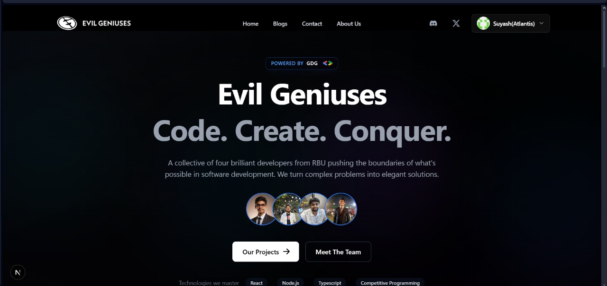

# 🧠 Evil Geniuses

  

<h2 align="center">A Portfolio Website by a Team of 4 Developers</h2>

A collaborative digital space to showcase our skills, projects, and passion for building.  
This isn't just a portfolio — it's where creativity meets clean code.

---

## 🔗 Live Demo

Check out the live version here:  <a href="https://wizard3-o.vercel.app/home">EVIL GENIUSES</a> 

---

## 🎥 Preview

  

---

## 🚀 About the Project

**Evil Geniuses** is a modern portfolio website built by a team of four passionate developers.  
It serves as a collective showcase of our technical skills, team projects, and shared enthusiasm for design and development.

This project is a blend of aesthetics and performance — built with cutting-edge tech, animated transitions, and real-time integrations.

---

## ✨ Features

- ⚡ **Sleek & Responsive UI**  
  Built using **Next.js**, styled with **Shadcn/UI** and **@ey** — fully responsive across all devices.

- 🎨 **Creative Dev Vibe**  
  Visually bold and animated — smooth transitions, interactive layouts, and a touch of personality.

- 🔐 **OAuth Login**  
  GitHub and Discord authentication with session management.

- 🤖 **Built-in ChatBot**  
  Real-time chatbot powered by AI to answer user queries.

- 📬 **Newsletter Integration**  
  Functional sign-up form to capture emails and build a dev audience.

- 📨 **Contact Us Form**  
  Sleek and functional contact form for visitors to connect with us directly.  
  The data of the contact form is sent to our Discord server via Webhooks: [Discord Server](https://discord.gg/bxnAezT4fK)

- 🧼 **Clean, Scalable Codebase**  
  Modular folder structure, reusable components, and clean logic — optimized for scalability and collaboration.

---

## 🛠 Tech Stack

**Frontend:**  
- [Next.js](https://nextjs.org/)  
- [React.js](https://reactjs.org/)  
- [Shadcn/UI](https://ui.shadcn.com/)  
- [Tailwind CSS](https://tailwindcss.com/)

**Backend:**  
- [MongoDB](https://www.mongodb.com/)  
- [Prisma ORM](https://www.prisma.io/)  
- [Better Auth / NextAuth](https://next-auth.js.org/)

**Deployment:**  
- [Vercel](https://vercel.com/)

**Version Control:**  
- Git & GitHub

---

## 👥 Team Evil Geniuses

- 🧠 [Suyash Padole](https://github.com/suyash-boop)
- 🚀 [Dhruv Khodke](https://github.com/Dhruv-117)
- 💡 [Aditya Bharde](https://github.com/AdityaBharde)
- 🔥 [Devansh Goel](https://github.com/goelDev)

---

### 🎓 Mentored by GDG RBU

---

## 🤝 Contributions

We welcome contributions!  
Feel free to fork this repo, submit pull requests, or open issues to collaborate with us.

---

## ⭐ Liked it?

Hope you liked this project!  
Don’t forget to give it a star ⭐

---

> _“Inspired by creativity. Driven by code. Powered by teamwork.”_

---
